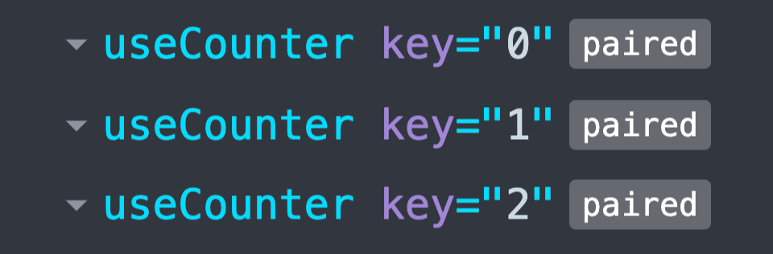

![Build Status][build-status-badge] ![Coverage][coverage-badge]
![License][license-badge] ![NPM Version][npm-version-badge]
![Open Issues][open-issues-badge]

🖇️ Util to help with the paired hook pattern.

## Installation

### Direct usage

For envs like [Deno][deno] or the browser:

```js
import { pair } from "https://esm.sh/react-pair";
```

### Local installation

For Node:

```sh
npm i react-pair
```

## Usage

```tsx
import { pair } from "react-pair";

const useCount = initialCount => {
	const [count, setCount] = useState(initialCount);

	return { onClick: () => setCount(count + 1), children: count };
};

const PairedCount = pair(useCount);

const Component = ({ array = [] }) => (
	<ul>
		{array.map(key => (
			<PairedCount key={key}>
				{usePairedCount => {
					const props = usePairedCount(key);

					return (
						<li>
							<button
								type="button"
								{...props}
							/>
						</li>
					);
				}}
			</PairedCount>
		))}
	</ul>
);
```

## React DevTools integration

<center>
	
</center>

## Documentation

Documentation can be found [HERE][documentation]. It is auto-generated with
[typedoc][typedoc] based on the JSDocs and the types in the source. Shouldn't be
necessary to read this, code editors like [VSCode][vscode] integrate the
documentation in the UI.

## Changelog

Changelog can be found [HERE][changelog].

<!-- Reference -->

[build-status-badge]:
	https://img.shields.io/github/workflow/status/vangware/react-pair/Test%20&%20Coverage.svg?style=for-the-badge&labelColor=666&color=2b7&link=https://github.com/vangware/react-pair/actions
[changelog]: https://github.com/vangware/react-pair/blob/main/CHANGELOG.md
[coverage-badge]:
	https://img.shields.io/coveralls/github/vangware/react-pair.svg?style=for-the-badge&labelColor=666&color=2b7&link=https://coveralls.io/github/vangware/react-pair
[deno]: https://deno.land/
[documentation]: https://react-pair.vangware.com
[license-badge]:
	https://img.shields.io/npm/l/react-pair.svg?style=for-the-badge&labelColor=666&color=2b7&link=https://github.com/vangware/react-pair/blob/main/LICENSE
[npm-version-badge]:
	https://img.shields.io/npm/v/react-pair.svg?style=for-the-badge&labelColor=666&color=2b7&link=https://npm.im/react-pair
[open-issues-badge]:
	https://img.shields.io/github/issues/vangware/react-pair.svg?style=for-the-badge&labelColor=666&color=2b7&link=https://github.com/vangware/react-pair/issues
[typedoc]: https://typedoc.org/
[vangware]: https://vangware.com
[vscode]: https://code.visualstudio.com/
